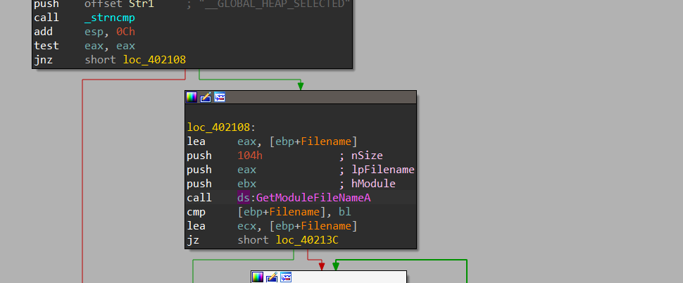
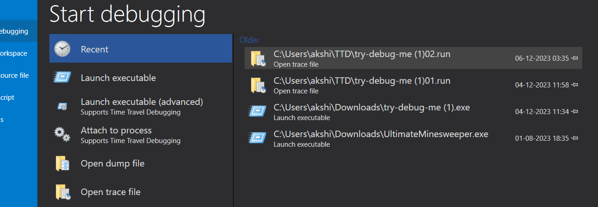
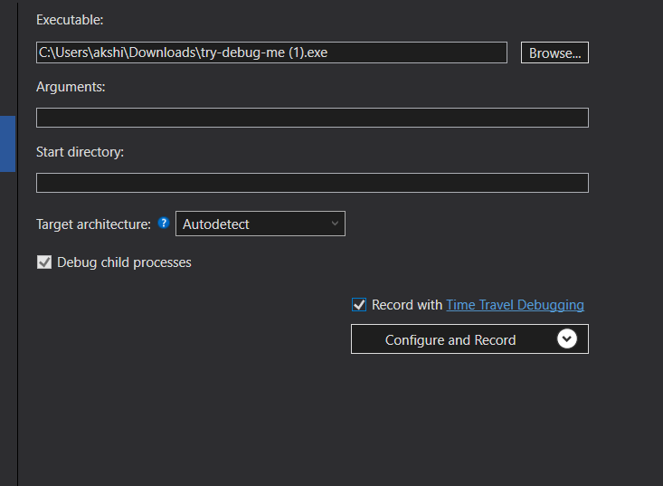
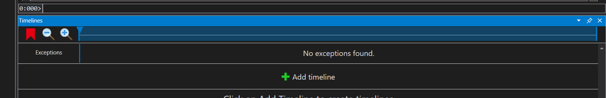
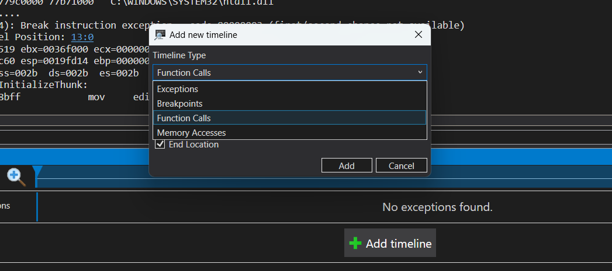

# Time-Travel Debugging

Time-Travel Debugging is a modern reversing technique that is used to speed up the process of debugging any executable file as it allows us to go back and forth the same executable file again and again while debugging it. 

It acts as a recording of the debugged file that can be referenced anywhere and seen anywhere anytime.

We will be demonstrating the technique using an executable file "ImagePrc.exe":

- Here we can see that the exe is using the function "GetModuleFileNameA()" of the library "kernel32". But it would take time to know the path the exe follows before calling this function.

- For this, we will use TTD in WinDBG Preview Version: 

    - First, open the exe inside the WinDbg TTD section

    

    - Check the checkbox of Record with TTD option:

    

    - After the exe exits or terminates, a timeline of the exe file will appear.

    

- Here you can add a new timeline to trace any calls in the recording of the exe file like Function calls, Exceptions occurences, Breakpoints and Memory Section Access calls: 

